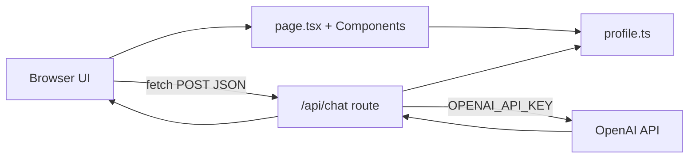

# Building Your Portfolio & Digital Twin — A Beginner’s Tutorial

This guide explains the **SITE** project: a personal portfolio website with an AI **Digital Twin** that answers questions about your career. It is written for someone new to frontend development. You do not need prior React experience, but basic comfort with files, folders, and the command line will help.

---

## Table of contents

1. [What you built](#what-you-built)
2. [Technology summary](#technology-summary)
3. [How to run the project](#how-to-run-the-project)
4. [High-level walkthrough](#high-level-walkthrough)
5. [Project structure](#project-structure)
6. [Detailed code review](#detailed-code-review)
7. [Customizing content](#customizing-content)
8. [Five ways to improve this project](#five-ways-to-improve-this-project)

---

## What you built

You have a **single-page marketing site** that includes:

| Section | Purpose |
|--------|---------|
| **Hero** | Name, title, short pitch, skill chips |
| **About** | Summary, stats, skills, education |
| **Journey** | Career timeline from your LinkedIn PDF |
| **Portfolio** | Placeholder cards for future case studies |
| **Digital Twin** | Chat UI that talks to OpenAI about your career |
| **Contact** | Email, phone, LinkedIn |

Visually, the site uses a dark “enterprise meets edgy” look: cyan accents, glass-style cards, grid backgrounds, and subtle motion.

---

## Technology summary

### Next.js (framework)

**Next.js** is a framework on top of **React**. React lets you build UIs from reusable **components** (functions that return HTML-like **JSX**). Next.js adds:

- **File-based routing** — files in `src/app` become URLs.
- **Server and client code** — some code runs only on the server (safe for secrets).
- **API routes** — backend endpoints in the same repo (e.g. `/api/chat`).

Think of Next.js as: *React + a built-in web server + conventions for folders*.

### TypeScript

**TypeScript** is JavaScript with **types** (labels for what shape data should have). It catches many mistakes before you run the app. Files use `.ts` (logic) and `.tsx` (logic + JSX).

### Tailwind CSS (styling)

Instead of writing separate `.css` files for every button, you add **utility classes** directly in JSX, e.g. `className="text-sm text-accent"`. Tailwind v4 in this project defines custom colors in `globals.css` under `@theme`.

### Framer Motion (animation)

**Framer Motion** animates React elements (fade-in, slide-up, modal open/close). Components that use browser-only features (state, effects, motion) are marked with `"use client"` at the top.

### OpenAI API (Digital Twin)

The **Digital Twin** sends your career text to OpenAI’s **chat completions** API with model **`gpt-5.2`**. The API key lives in `.env` as `OPENAI_API_KEY` and is read **only on the server** — never shipped to the visitor’s browser.

### npm (package manager)

**npm** installs libraries listed in `package.json` and runs scripts like `npm run dev`.

---

## How to run the project

1. Install [Node.js](https://nodejs.org/) (LTS version).
2. Open a terminal in the project folder (`SITE`).
3. Install dependencies (once):

   ```bash
   npm install
   ```

4. Create or edit `.env` in the project root (same folder as `package.json`):

   ```env
   OPENAI_API_KEY=your_key_here
   ```

   Never commit `.env` to git (it is listed in `.gitignore`).

5. Start the development server:

   ```bash
   npm run dev
   ```

6. Open the URL printed in the terminal (usually `http://localhost:3000`).

Other useful commands:

- `npm run build` — production build (checks types and compiles).
- `npm run start` — run the production build locally.
- `npm run lint` — run ESLint for code quality hints.

---

## High-level walkthrough

### Visitor journey

1. The browser requests `/`.
2. Next.js serves the **Home** page built from `src/app/page.tsx`.
3. `layout.tsx` wraps every page (fonts, global CSS, HTML shell).
4. The page composes sections: `Header`, `Hero`, `About`, etc.
5. Text and career data come from **`src/data/profile.ts`** (single source of truth).
6. When the user chats, the **browser** calls **`POST /api/chat`** on your Next server.
7. The API route builds a **system prompt** from profile data, calls OpenAI, and returns JSON `{ message: "..." }`.
8. `DigitalTwinChat` displays the reply in the modal.

### Architecture diagram



### Server vs client components

| Runs on | Examples | Why |
|--------|----------|-----|
| **Server** (default in App Router) | `page.tsx` (no `"use client"`), `layout.tsx`, `api/chat/route.ts` | SEO, no secret leakage, less JS to download |
| **Client** (`"use client"`) | `Hero`, `DigitalTwinChat`, `Header` | `useState`, `useEffect`, Framer Motion, `fetch` from browser |

Rule of thumb: use **server** unless you need interactivity or browser APIs.

---

## Project structure

```
SITE/
├── .env                    # Secrets (OPENAI_API_KEY) — not in git
├── package.json            # Dependencies and scripts
├── next.config.ts          # Next.js configuration
├── postcss.config.mjs      # Tailwind / PostCSS
├── public/
│   └── favicon.svg
└── src/
    ├── app/
    │   ├── layout.tsx      # Root HTML shell, fonts, metadata
    │   ├── page.tsx        # Home page — assembles all sections
    │   ├── globals.css     # Theme colors, utilities, animations
    │   └── api/
    │       └── chat/
    │           └── route.ts  # Digital Twin backend
    ├── components/         # UI sections (Header, Hero, …)
    ├── data/
    │   └── profile.ts      # Your copy, career, skills, nav links
    └── lib/
        └── digital-twin-context.ts  # System prompt for OpenAI
```

The `@/` import alias in `tsconfig.json` means `@/components/Header` → `src/components/Header`.

---

## Detailed code review

### 1. Central data: `profile.ts`

All marketing copy and career facts live in one file so you can update the site without hunting through components.

```typescript
export const site = {
  name: "Subramaniam Ananthakrishnan",
  title: "Senior Lead Developer",
  company: "Cimpress India",
  // email, phone, linkedIn, summary, yearsExperience, …
} as const;

export const career: CareerRole[] = [
  {
    company: "VistaPrint India (Cimpress)",
    role: "Senior Lead Developer",
    period: "Jul 2021 — Present",
    highlights: [ "…", "…" ],
  },
  // more roles…
];

export const navItems = [
  { label: "About", href: "#about" },
  { label: "Digital Twin", href: "#twin" },
  // …
] as const;
```

**Beginner notes:**

- `export` makes values importable in other files.
- `as const` tells TypeScript these objects are read-only and helps autocomplete.
- `href: "#about"` scrolls to the element with `id="about"` on the same page.

---

### 2. App shell: `layout.tsx`

The root layout runs once per page and sets fonts, metadata, and global body classes.

```tsx
import { Syne, IBM_Plex_Sans } from "next/font/google";
import "./globals.css";
import { site } from "@/data/profile";

const syne = Syne({ subsets: ["latin"], variable: "--font-syne" });

export const metadata: Metadata = {
  title: `${site.name} | ${site.title}`,
  description: site.summary,
};

export default function RootLayout({ children }: { children: React.ReactNode }) {
  return (
    <html lang="en" className={`${syne.variable} ${ibmPlex.variable}`}>
      <body className="mesh-bg min-h-screen antialiased">{children}</body>
    </html>
  );
}
```

**Beginner notes:**

- `children` is whatever page Next.js is rendering (here, `page.tsx`).
- `next/font/google` downloads fonts efficiently at build time.
- `metadata` improves browser tab title and link previews (Open Graph).

---

### 3. Composing the home page: `page.tsx`

The home page is a **layout of components** — no business logic, easy to read.

```tsx
import { Header } from "@/components/Header";
import { Hero } from "@/components/Hero";
import { DigitalTwinChat } from "@/components/DigitalTwinChat";
// …other imports

export default function Home() {
  return (
    <>
      <Header />
      <main>
        <Hero />
        <About />
        <Journey />
        <Portfolio />
        <DigitalTwinChat />
        <Contact />
      </main>
      <Footer />
    </>
  );
}
```

**Beginner notes:**

- `<>...</>` is a **Fragment** — groups elements without adding an extra DOM node.
- Order here is the order users see on the page.
- This file is a **Server Component** (no `"use client"`), so it stays lightweight.

---

### 4. Styling system: `globals.css`

Tailwind v4 defines design tokens once; components reference them as classes like `bg-ink` or `text-accent`.

```css
@theme inline {
  --color-ink: #0a0c10;
  --color-accent: #00e5c7;
  --color-text-muted: #9aa3b5;
  /* … */
}

.mesh-bg {
  background:
    radial-gradient(ellipse 80% 50% at 50% -20%, rgba(0, 229, 199, 0.12), transparent),
    var(--color-ink);
}

.glass-panel {
  border: 1px solid var(--color-border);
  backdrop-filter: blur(12px);
}
```

**Beginner notes:**

- Custom classes (`.mesh-bg`, `.glass-panel`) combine with Tailwind utilities in JSX.
- `prefers-reduced-motion` rules respect users who disable animations.

---

### 5. Interactive UI example: `Hero.tsx`

Client components use hooks and animation libraries.

```tsx
"use client";

import { motion } from "framer-motion";
import { site, skills } from "@/data/profile";

export function Hero() {
  return (
    <section className="relative min-h-[92vh] pt-24">
      <motion.h1
        initial={{ opacity: 0, y: 24 }}
        animate={{ opacity: 1, y: 0 }}
      >
        {site.name}
      </motion.h1>
      {/* skill chips from skills array */}
    </section>
  );
}
```

**Beginner notes:**

- `"use client"` is required because of `motion` and animation state.
- JSX `{site.name}` inserts a JavaScript expression into the HTML.
- Responsive design uses prefixes like `sm:` and `lg:` on Tailwind classes (not shown in full above).

Similar patterns appear in `About.tsx`, `Journey.tsx` (timeline), `Portfolio.tsx`, and `Contact.tsx`.

---

### 6. Digital Twin prompt: `digital-twin-context.ts`

This file turns structured profile data into one long **system prompt** string for the AI.

```typescript
export function buildDigitalTwinSystemPrompt(): string {
  const careerBlock = career
    .map((role) => `### ${role.role} @ ${role.company}\n…`)
    .join("\n\n");

  return `You are the Digital Twin of ${site.name}…
## Ground truth (only use this information…)
${careerBlock}
## Rules
- Do not invent employers or dates…`;
}

export const DIGITAL_TWIN_MODEL = "gpt-5.2";
```

**Beginner notes:**

- **System prompt** = instructions + facts the model must follow.
- Keeping facts in sync with `profile.ts` avoids duplicating career text in two places manually (the prompt is generated from the same data).
- The model name is a constant so you can change it in one place.

---

### 7. Secure API: `src/app/api/chat/route.ts`

API routes export HTTP method functions (`GET`, `POST`, …). This app only implements **POST**.

```typescript
export async function POST(request: Request) {
  const apiKey = process.env.OPENAI_API_KEY;
  if (!apiKey) {
    return NextResponse.json({ error: "OpenAI API key is not configured." }, { status: 500 });
  }

  const body = await request.json();
  const messages = body.messages; // validated and trimmed…

  const openai = new OpenAI({ apiKey });
  const completion = await openai.chat.completions.create({
    model: DIGITAL_TWIN_MODEL,
    messages: [
      { role: "system", content: buildDigitalTwinSystemPrompt() },
      ...messages,
    ],
    temperature: 0.4,
    max_completion_tokens: 1024,
  });

  return NextResponse.json({ message: completion.choices[0]?.message?.content });
}
```

**Beginner notes:**

- `process.env.OPENAI_API_KEY` reads from `.env` **on the server only**.
- The route validates input (array of messages, length limits, last message must be from user) to reduce abuse and mistakes.
- Errors from OpenAI (401 invalid key, 429 billing/rate limit) are mapped to clear JSON errors for the UI.
- `temperature: 0.4` = fairly focused answers; higher = more creative.

---

### 8. Chat UI: `DigitalTwinChat.tsx`

The chat keeps **local state** for the conversation and calls your API with `fetch`.

```tsx
"use client";

const [messages, setMessages] = useState<ChatMessage[]>([/* welcome */]);
const [loading, setLoading] = useState(false);

async function sendMessage(text: string) {
  setLoading(true);
  const res = await fetch("/api/chat", {
    method: "POST",
    headers: { "Content-Type": "application/json" },
    body: JSON.stringify({ messages: apiMessages }),
  });
  const data = await res.json();
  setMessages((prev) => [...prev, { role: "assistant", content: data.message }]);
  setLoading(false);
}
```

**Beginner notes:**

- `useState` stores data that changes over time (each new message re-renders the list).
- `useEffect` scrolls the message list and focuses the input when the modal opens.
- The welcome message uses `id: "welcome"` and is **filtered out** before sending history to the API so the backend only sees real user/assistant turns.
- UI pieces: section `#twin`, floating button, modal with `AnimatePresence` for enter/exit animation.

---

### 9. Navigation and accessibility touches

- **`Header.tsx`**: sticky nav, scroll-based background, mobile `<details>` menu, LinkedIn CTA.
- **`ScrollProgress.tsx`**: thin accent bar at the top tied to scroll position (`useScroll` from Framer Motion).
- **Skip link** in `page.tsx`: hidden until keyboard focus — helps screen reader and keyboard users jump to `#about`.

---

### 10. Dependencies snapshot (`package.json`)

```json
{
  "scripts": {
    "dev": "next dev --turbopack",
    "build": "next build",
    "start": "next start"
  },
  "dependencies": {
    "next": "^15.5.4",
    "react": "^19.1.1",
    "framer-motion": "^12.23.22",
    "openai": "^7.23.0"
  }
}
```

**Turbopack** speeds up local development bundling; production `build` still uses Next’s standard compiler pipeline.

---

## Customizing content

| Goal | Where to edit |
|------|----------------|
| Name, summary, contact | `src/data/profile.ts` → `site` |
| Jobs and bullets | `src/data/profile.ts` → `career` |
| Skills / education | `src/data/profile.ts` |
| Nav labels and anchors | `src/data/profile.ts` → `navItems` + matching `id` on sections |
| Colors and fonts | `src/app/globals.css`, `layout.tsx` |
| AI behavior / model | `src/lib/digital-twin-context.ts`, `DIGITAL_TWIN_MODEL` |
| Portfolio links when ready | `portfolioLinks` in `profile.ts` — set real `href` and status |

After editing, save the file; the dev server usually **hot-reloads** automatically.

---

## Five ways to improve this project

These are sensible next steps from a self-review — not bugs, but upgrades a growing site would benefit from.

1. **Stream responses from OpenAI**  
   Today the API waits for the full reply, then returns JSON. **Streaming** (`stream: true`) lets tokens appear word-by-word in the chat UI, which feels faster and more modern. The client would use `ReadableStream` or a small library instead of a single `res.json()`.

2. **Rate limiting and abuse protection**  
   `/api/chat` is public to anyone who can load your site. Add per-IP rate limits (e.g. Upstash Redis, Vercel KV, or middleware) and optional CAPTCHA for production deployment so API costs stay predictable.

3. **Persist chat optionally / privacy notice**  
   Conversations exist only in browser memory and are lost on refresh. For a portfolio, add a short privacy note (“Chats are sent to OpenAI and not stored”) and, if needed, server-side logging policies. Avoid storing PII unless you have a clear compliance story.

4. **Tests and CI**  
   There are no automated tests yet. Add a minimal **Playwright** smoke test (home loads, modal opens) and a unit test for `buildDigitalTwinSystemPrompt()` so career edits do not break the prompt shape. Run `npm run build` and tests in GitHub Actions on every push.

5. **Deployment and environment hardening**  
   Document deployment to [Vercel](https://vercel.com) (natural fit for Next.js): set `OPENAI_API_KEY` in the dashboard, enable analytics, and use **preview deployments** for changes. Consider splitting “marketing site” and “chat API” budgets, monitoring 429/5xx rates, and using a cheaper/smaller model for simple FAQ-style questions if traffic grows.

---

## Glossary (quick reference)

| Term | Meaning |
|------|---------|
| **Component** | Reusable UI function (e.g. `Hero`) |
| **JSX** | HTML-like syntax inside JavaScript/TypeScript |
| **Props** | Inputs passed to a component |
| **State** | Data that changes inside a component (`useState`) |
| **API route** | Server endpoint in `app/api/.../route.ts` |
| **Environment variable** | Secret or config in `.env`, read via `process.env` |

---

## Closing thought

You now have a **content-driven** portfolio: change `profile.ts` and the whole site and Digital Twin stay aligned. The split between **server** (secrets, OpenAI) and **client** (animation, chat UI) is the most important pattern to remember as you extend the project.

When you are ready to go deeper, the official docs are excellent starting points: [Next.js Learn](https://nextjs.org/learn), [React docs](https://react.dev), and [Tailwind CSS](https://tailwindcss.com/docs).
